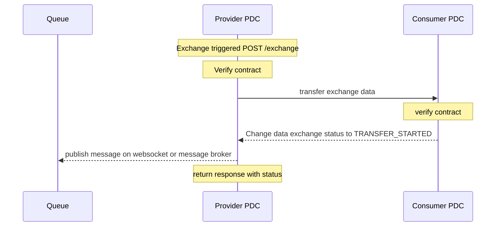
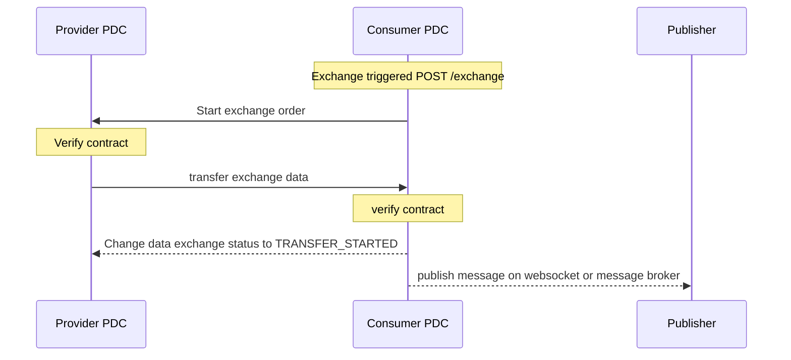
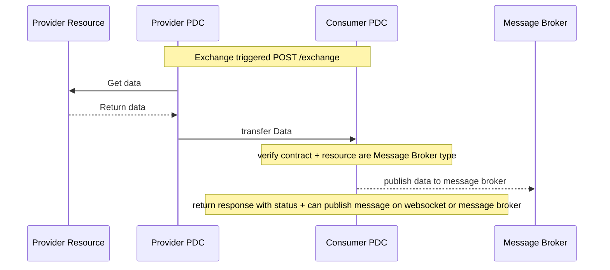
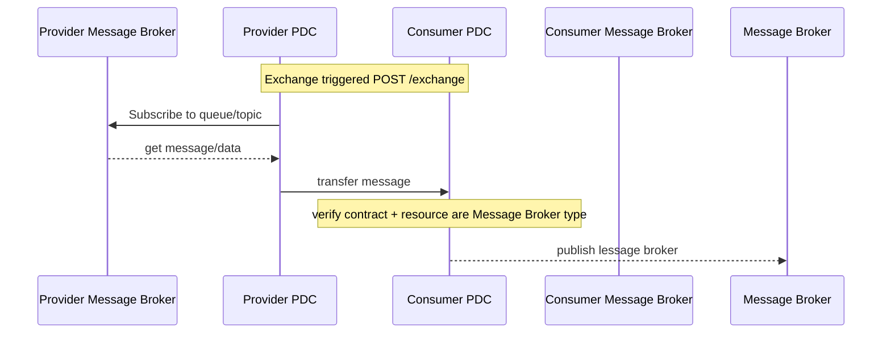

# Message Broker

Multiple workflow are possible, such as:

## Push or Pull to publish message
> local PDC configuration define the unique message broker server and queue/topic
> message received by who trigger the exchange




## Provider data is published in queue by the consumer connector

> The consumer can push provider data to message broker
> Metadata on the software representation define the message broker connection info


> only for software Representation

```json
[
  {
    "_id": {
      "$oid": "696607fbfb278a716f8ba398"
    },
    "method": "none",
    "resourceID": "696607fbfb278a716f8ba395",
    "type": "MESSAGE_BROKER",
    "broker": {
      "topic": "data_exchange_topic",//kafka
      "brokerType": "kafka", //websocket, amqp, mqtt
      "credentials": "696607fbfb278a716f8ba398",
      "host": "broker.example.com",
      "port": 9092,
      "queue": "data_exchange_queue",//amqp, mqtt
      "uri": "" //websoket
    },
    ... // Other common representation fields
  }
]
```

## Provider subscribe to queue and push message to consumer



> Data representation allow to subscribe to message broker and push message/data to consumer
> Software Representation allow to publish to a queue/topic

```json
[
  {
    "_id": {
      "$oid": "696607fbfb278a716f8ba398"
    },
    "method": "none",
    "resourceID": "696607fbfb278a716f8ba395",
    "type": "MESSAGE_BROKER",
    "broker": {
      "topic": "data_exchange_topic",//kafka
      "brokerType": "kafka", //websocket, amqp, mqtt
      "credentials": "696607fbfb278a716f8ba398",
      "host": "broker.example.com",
      "port": 9092,
      "queue": "data_exchange_queue",//amqp, mqtt
      "uri": "" //websoket
    },
    ... // Other common representation fields
  }
]
```

## Other flows

- Provider can push message to data broker